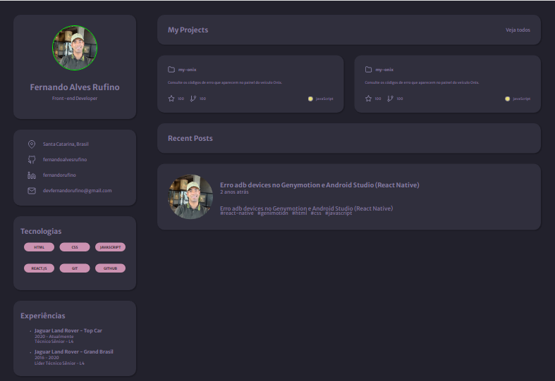

<h1 align="center">Portfolio Page</h1>

A web page to be used as a portfolio and resume using HTML and CSS

 

  <a href="#-technologies">Technologies</a>&nbsp;&nbsp;&nbsp;|&nbsp;&nbsp;&nbsp;
  <a href="#-project">Project</a>&nbsp;&nbsp;&nbsp;|&nbsp;&nbsp;&nbsp;
  <a href="#memo-license">License</a>&nbsp;&nbsp;&nbsp;|&nbsp;&nbsp;&nbsp;
  <a href="#readme-in-portuguese">README in Portuguese</a>

  

  

## Technologies

- HTML
- CSS
- Git and GitHub
- Figma

## Project

Rocketseat Challenge: create a web page to be used as your portfolio and resume using HTML and CSS.

- To access the finished project, [click here](https://fernandoalvesrufino.github.io/portfolio-page/).

## :memo: License

This project is under the MIT license.

---

by Fernando Rufino

`Challenge created by Rocketseat`

## README in Portuguese

<h1 align="center"> Página de Portfólio </h1>

Uma página web para ser usada como portfolio e currículo utilizando HTML e CSS

 

  <a href="#-tecnologias">Tecnologias</a>&nbsp;&nbsp;&nbsp;|&nbsp;&nbsp;&nbsp;
  <a href="#-projeto">Projeto</a>&nbsp;&nbsp;&nbsp;|&nbsp;&nbsp;&nbsp;
  <a href="#memo-licença">Licença</a>

  

  

## Tecnologias 
- HTML
- CSS
- Git e GitHub
- Figma

## Projeto

Desafio Rocketseat: criar uma página web para que seja seu portfolio e currículo utilizando HTML e CSS.

- Para acessar ao projeto finalizado, [clique aqui](https://fernandoalvesrufino.github.io/portfolio-page/).

 
## :memo: Licença

Esse projeto está sob a licença MIT.

---

by Fernando Rufino

`Desafio criado pela Rocketseat`